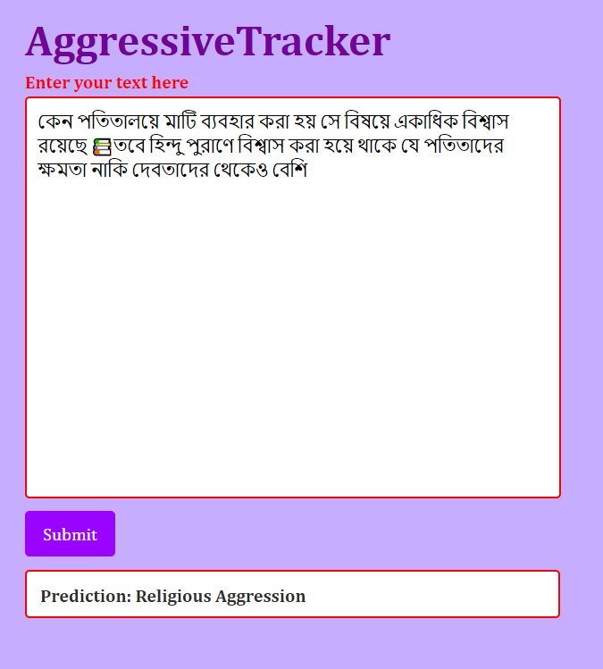

# Aggressive Text Detection API

## About

This repository contains code for an aggressive text detection API built using FastAPI. The API allows users to input Bangla text, and it predicts the aggression level of the text using a pre-trained model.

### Supported Aggression Categories:

- Religious Aggression
- Political Aggression
- Verbal Aggression
- Gendered Aggression

